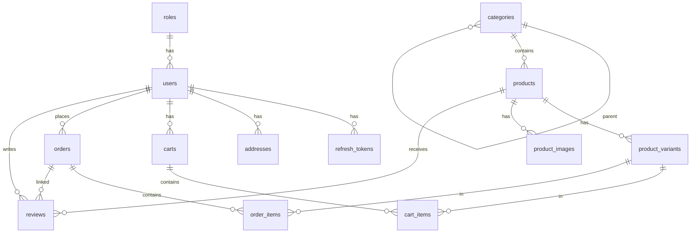

# Database Documentation

## Overview

- **Database**: MySQL 8.x
- **ORM**: TypeORM (NestJS integration)
- **Architecture**: Feature-based organization

### Naming Conventions

| Element | Convention | Example |
|---------|------------|---------|
| Tables | snake_case, plural | `users`, `order_items` |
| Columns | snake_case | `created_at`, `user_id` |
| Foreign Keys | `[singular_table]_id` | `product_id`, `cart_id` |
| Indexes | `idx_[table]_[column]` | `idx_users_email` |

---

## Entities by Feature

### Auth Feature

**roles**
| Column | Type | Constraints |
|--------|------|-------------|
| id | BIGINT | PK, AUTO_INCREMENT |
| name | VARCHAR(50) | NOT NULL, UNIQUE |

**users**
| Column | Type | Constraints |
|--------|------|-------------|
| id | BIGINT | PK, AUTO_INCREMENT |
| role_id | BIGINT | FK → roles |
| email | VARCHAR(255) | NOT NULL, UNIQUE |
| password_hash | VARCHAR(255) | NOT NULL |
| full_name | VARCHAR(100) | NOT NULL |
| phone | VARCHAR(20) | NULLABLE |
| is_active | BOOLEAN | DEFAULT TRUE |
| created_at | DATETIME | AUTO |
| updated_at | DATETIME | AUTO |

**refresh_tokens**
| Column | Type | Constraints | Description |
|--------|------|-------------|-------------|
| id | BIGINT | PK, AUTO_INCREMENT | |
| user_id | BIGINT | FK → users, NOT NULL | Token owner |
| token_hash | VARCHAR(255) | NOT NULL, UNIQUE | Hashed token (never plain) |
| device_name | VARCHAR(100) | NULLABLE | "Chrome on Windows" |
| ip_address | VARCHAR(45) | NULLABLE | IPv4/IPv6 |
| user_agent | VARCHAR(255) | NULLABLE | Browser/app info |
| expires_at | DATETIME | NOT NULL | Expiration time |
| is_revoked | BOOLEAN | DEFAULT FALSE | Soft revoke flag |
| created_at | DATETIME | AUTO | |

### User Profile Feature

**addresses**
| Column | Type | Constraints |
|--------|------|-------------|
| id | BIGINT | PK, AUTO_INCREMENT |
| user_id | BIGINT | FK → users |
| full_name | VARCHAR(100) | NOT NULL |
| phone | VARCHAR(20) | NOT NULL |
| address_line | VARCHAR(255) | NOT NULL |
| city | VARCHAR(100) | NOT NULL |
| is_default | BOOLEAN | DEFAULT FALSE |

### Product Catalog Feature

**categories** (self-referencing for nested structure)
| Column | Type | Constraints |
|--------|------|-------------|
| id | BIGINT | PK, AUTO_INCREMENT |
| parent_id | BIGINT | FK → categories, NULLABLE |
| name | VARCHAR(100) | NOT NULL |
| slug | VARCHAR(100) | NOT NULL, UNIQUE |

**products**
| Column | Type | Constraints |
|--------|------|-------------|
| id | BIGINT | PK, AUTO_INCREMENT |
| category_id | BIGINT | FK → categories |
| name | VARCHAR(255) | NOT NULL |
| slug | VARCHAR(255) | NOT NULL, UNIQUE |
| description | TEXT | NULLABLE |
| thumbnail_url | VARCHAR(500) | NULLABLE |
| is_active | BOOLEAN | DEFAULT TRUE |
| created_at | DATETIME | AUTO |
| updated_at | DATETIME | AUTO |

**product_variants** ⚠️ *Cart & Order link here, NOT products*
| Column | Type | Constraints |
|--------|------|-------------|
| id | BIGINT | PK, AUTO_INCREMENT |
| product_id | BIGINT | FK → products |
| sku | VARCHAR(50) | NOT NULL, UNIQUE |
| color | VARCHAR(50) | NULLABLE |
| size | VARCHAR(20) | NULLABLE |
| price | DECIMAL(12,2) | NOT NULL |
| sale_price | DECIMAL(12,2) | NULLABLE |
| stock_quantity | INT | DEFAULT 0 |

**product_images**
| Column | Type | Constraints |
|--------|------|-------------|
| id | BIGINT | PK, AUTO_INCREMENT |
| product_id | BIGINT | FK → products |
| image_url | VARCHAR(500) | NOT NULL |
| sort_order | INT | DEFAULT 0 |

### Shopping Cart Feature

**carts**
| Column | Type | Constraints |
|--------|------|-------------|
| id | BIGINT | PK, AUTO_INCREMENT |
| user_id | BIGINT | FK → users, NULLABLE (guest cart) |
| session_id | VARCHAR(100) | NULLABLE |
| created_at | DATETIME | AUTO |

**cart_items**
| Column | Type | Constraints |
|--------|------|-------------|
| id | BIGINT | PK, AUTO_INCREMENT |
| cart_id | BIGINT | FK → carts |
| product_variant_id | BIGINT | FK → product_variants |
| quantity | INT | NOT NULL, DEFAULT 1 |

### Order Feature

**orders**
| Column | Type | Constraints |
|--------|------|-------------|
| id | BIGINT | PK, AUTO_INCREMENT |
| user_id | BIGINT | FK → users |
| status | VARCHAR(20) | ENUM: pending/confirmed/shipping/delivered/cancelled |
| payment_method | VARCHAR(50) | NOT NULL |
| payment_status | VARCHAR(20) | ENUM: unpaid/paid |
| shipping_fee | DECIMAL(12,2) | DEFAULT 0 |
| total_amount | DECIMAL(12,2) | NOT NULL |
| shipping_address | JSON | Snapshot (NOT FK) |
| created_at | DATETIME | AUTO |

**order_items** — *Snapshot data for history integrity*
| Column | Type | Constraints |
|--------|------|-------------|
| id | BIGINT | PK, AUTO_INCREMENT |
| order_id | BIGINT | FK → orders |
| product_variant_id | BIGINT | FK → product_variants |
| product_name | VARCHAR(255) | Snapshot |
| sku | VARCHAR(50) | Snapshot |
| price | DECIMAL(12,2) | Snapshot |
| quantity | INT | NOT NULL |
| thumbnail_url | VARCHAR(500) | Snapshot |

### Review Feature

**reviews** — *3-way link ensures verified purchases*
| Column | Type | Constraints |
|--------|------|-------------|
| id | BIGINT | PK, AUTO_INCREMENT |
| user_id | BIGINT | FK → users |
| product_id | BIGINT | FK → products |
| order_id | BIGINT | FK → orders |
| rating | TINYINT | 1-5 |
| comment | TEXT | NULLABLE |
| created_at | DATETIME | AUTO |

---

## ERD Diagram



---

## Key Relationships

| Relationship | Type | Notes |
|--------------|------|-------|
| roles → users | 1:N | Role-based access |
| users → refresh_tokens | 1:N | Multi-device support |
| categories → categories | 1:N | Self-ref for nesting |
| **product_variants** → cart_items, order_items | 1:N | ⚠️ Transaction center |
| orders.shipping_address | JSON | Snapshot, NOT FK |
| order_items fields | Snapshot | Preserves history |

---

## Conventions

- **Primary Key**: Auto-increment BIGINT (`id`)
- **Soft Delete**: `is_active` (users, products), `is_revoked` (tokens)
- **Timestamps**: `created_at`, `updated_at` (TypeORM auto-managed)
- **Enums**: Stored as strings
- **Token Storage**: Always hashed (`token_hash`), never plain text

---

## Indexes

```sql
-- Auth
CREATE INDEX idx_users_email ON users(email);
CREATE INDEX idx_refresh_tokens_token_hash ON refresh_tokens(token_hash);
CREATE INDEX idx_refresh_tokens_user_id ON refresh_tokens(user_id);
CREATE INDEX idx_refresh_tokens_expires_at ON refresh_tokens(expires_at);

-- Products
CREATE INDEX idx_products_slug ON products(slug);
CREATE INDEX idx_products_category_id ON products(category_id);
CREATE INDEX idx_product_variants_sku ON product_variants(sku);

-- Orders
CREATE INDEX idx_orders_user_id ON orders(user_id);
CREATE INDEX idx_orders_status ON orders(status);
```

---

## Migration Rules

- **Format**: `[timestamp]_[description].ts` (e.g., `1699999999999_create_users_table.ts`)
- **Reversible**: Always implement both `up()` and `down()` methods
- **No data loss**: Rollback must preserve data integrity

---

## TypeORM Notes

```typescript
// Example: product_variants entity
@Entity('product_variants')
export class ProductVariant {
  @PrimaryGeneratedColumn('increment', { type: 'bigint' })
  id: number;

  @ManyToOne(() => Product, (product) => product.variants)
  @JoinColumn({ name: 'product_id' })
  product: Product;

  @OneToMany(() => CartItem, (item) => item.productVariant)
  cartItems: CartItem[];
}
```

**Best Practices**:
- Enable cascade on `cart → cart_items` (delete cart removes items)
- Use eager loading sparingly (performance impact)
- Periodic cleanup job for expired/revoked `refresh_tokens`

---

## Refresh Token Use Cases

| Action | Implementation |
|--------|----------------|
| Login | Create new `refresh_tokens` record |
| Refresh | Find by `token_hash`, validate `expires_at` & `is_revoked` |
| Logout | Set `is_revoked = true` for current token |
| Logout all | Set `is_revoked = true` WHERE `user_id = ?` |
| View sessions | List WHERE `is_revoked = false AND expires_at > NOW()` |