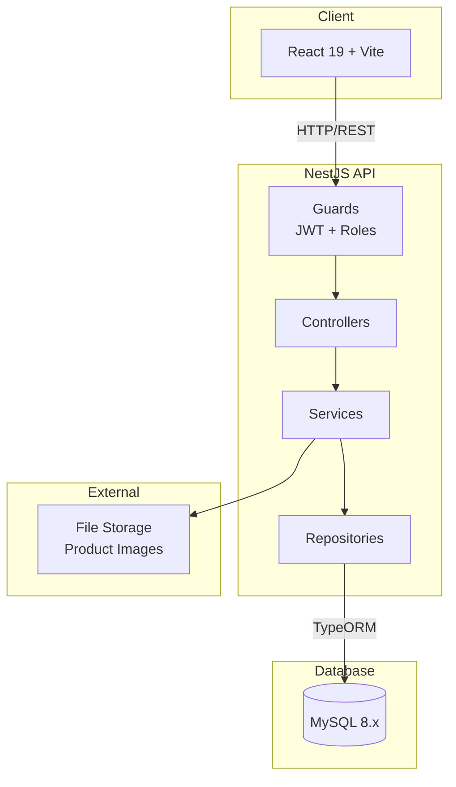
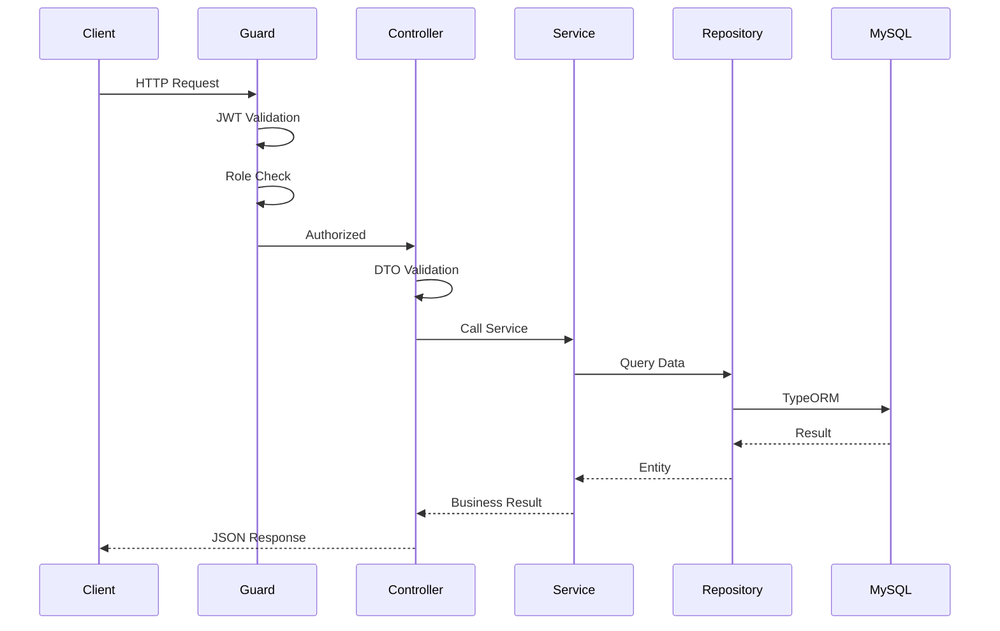
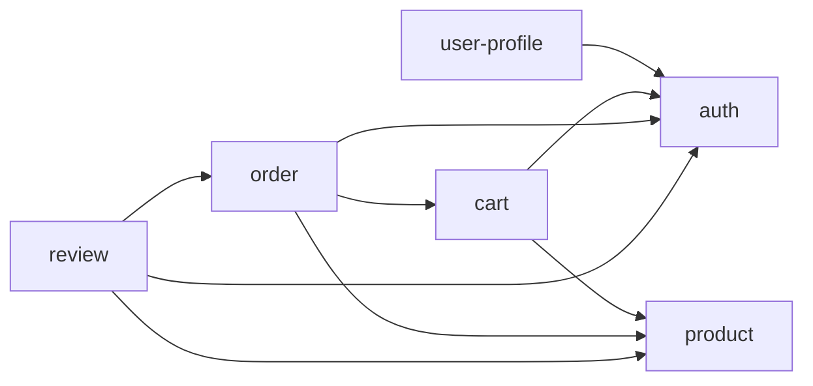

# Backend Architecture

## System Overview



**Architecture**: Monolith with feature-based modules
- Each feature = 1 NestJS module (self-contained)
- Easy to extract to microservices later if needed

---

## Folder Structure

```
src/
├── main.ts                         # Bootstrap, global pipes/filters
├── app.module.ts                   # Root module, imports all features
│
├── config/
│   ├── database.config.ts          # TypeORM configuration
│   ├── jwt.config.ts               # JWT secret, expiration
│   └── app.config.ts               # PORT, NODE_ENV
│
├── core/
│   ├── database/
│   │   └── database.module.ts      # TypeORM connection (async)
│   └── logger/
│       └── logger.module.ts        # Custom logger setup
│
├── shared/
│   ├── decorators/
│   │   ├── current-user.decorator.ts
│   │   ├── roles.decorator.ts
│   │   └── public.decorator.ts
│   ├── filters/
│   │   └── http-exception.filter.ts
│   ├── guards/
│   │   ├── jwt-auth.guard.ts
│   │   └── roles.guard.ts
│   ├── interceptors/
│   │   ├── transform.interceptor.ts
│   │   └── logging.interceptor.ts
│   ├── pipes/
│   │   └── validation.pipe.ts
│   ├── utils/
│   │   ├── pagination.util.ts
│   │   └── hash.util.ts
│   └── types/
│       ├── response.type.ts
│       └── pagination.type.ts
│
└── features/
    ├── auth/                       # roles, users, refresh_tokens, JWT
    ├── user-profile/               # addresses
    ├── product/                    # categories, products, variants, images
    ├── cart/                       # carts, cart_items
    ├── order/                      # orders, order_items, checkout
    └── review/                     # reviews
```

---

## Feature Anatomy

### Simple Feature (auth)
```
features/auth/
├── auth.module.ts
├── auth.controller.ts
├── auth.service.ts
├── repositories/
│   ├── user.repository.ts
│   ├── role.repository.ts
│   └── refresh-token.repository.ts
├── dto/
│   ├── register.dto.ts
│   ├── login.dto.ts
│   └── refresh-token.dto.ts
├── entities/
│   ├── user.entity.ts
│   ├── role.entity.ts
│   └── refresh-token.entity.ts
├── types/
│   └── jwt-payload.type.ts
├── strategies/
│   └── jwt.strategy.ts
├── tests/
└── CONTEXT.md
```

### Complex Feature (product) — Multiple controllers/services
```
features/product/
├── product.module.ts
├── controllers/
│   ├── category.controller.ts
│   ├── product.controller.ts
│   └── product-variant.controller.ts
├── services/
│   ├── category.service.ts
│   ├── product.service.ts
│   └── product-variant.service.ts
├── repositories/
│   ├── category.repository.ts
│   ├── product.repository.ts
│   ├── product-variant.repository.ts
│   └── product-image.repository.ts
├── entities/
│   ├── category.entity.ts
│   ├── product.entity.ts
│   ├── product-variant.entity.ts
│   └── product-image.entity.ts
├── dto/
├── tests/
└── CONTEXT.md
```

### Feature with Business Logic (order)
```
features/order/
├── order.module.ts
├── order.controller.ts
├── services/
│   ├── order.service.ts
│   └── checkout.service.ts         # Cart → Order conversion
├── repositories/
├── entities/
├── types/
│   ├── order-status.type.ts
│   └── payment-status.type.ts
├── tests/
└── CONTEXT.md
```

---

## Request Flow



### Layer Responsibilities

| Layer | Responsibility |
|-------|----------------|
| Guard | JWT validation, role checking |
| Controller | Routing, DTO validation, response format |
| Service | Business logic, transactions, orchestration |
| Repository | Data access, TypeORM queries |

### Example: Checkout Flow

```
POST /orders/checkout
    → JwtAuthGuard validates token
    → OrderController receives CreateOrderDto
    → CheckoutService:
        1. Get cart (CartRepository)
        2. Validate stock (ProductVariantRepository)
        3. Create order with snapshots (JSON address, product info)
        4. Clear cart
        5. Transaction via QueryRunner
    → Return OrderResponseDto
```

---

## Cross-Feature Communication

### Feature Dependencies



### Allowed Methods

```typescript
// ✅ Module imports (NestJS DI)
@Module({
  imports: [ProductModule, CartModule],
  providers: [CheckoutService],
})
export class OrderModule {}

// ✅ Event-based (async)
this.eventEmitter.emit('order.created', { orderId, userId });

// ❌ FORBIDDEN: Direct imports
import { UserService } from '../auth/auth.service';
```

---

## Shared vs Core

| Shared (cross-feature utilities) | Core (infrastructure) |
|----------------------------------|----------------------|
| `@CurrentUser()`, `@Roles()`, `@Public()` | TypeORM database connection |
| `JwtAuthGuard`, `RolesGuard` | Logger configuration |
| `HttpExceptionFilter` | Environment config loading |
| `TransformInterceptor` | |
| Pagination, Hash utilities | |
| Response/Pagination types | |

---

## Configuration

### Environment Variables

```bash
# Database
DB_HOST=localhost
DB_PORT=3306
DB_USERNAME=root
DB_PASSWORD=secret
DB_NAME=hoidanit_ecommerce

# JWT
JWT_SECRET=your-secret-key
JWT_EXPIRES_IN=15m
JWT_REFRESH_EXPIRES_IN=7d

# App
PORT=3000
NODE_ENV=development
```

### Config Files

```typescript
// config/database.config.ts
export default registerAs('database', () => ({
  host: process.env.DB_HOST,
  port: parseInt(process.env.DB_PORT, 10),
  // ...
}));

// Usage in module
@Module({
  imports: [
    ConfigModule.forRoot({ isGlobal: true }),
    TypeOrmModule.forRootAsync({
      inject: [ConfigService],
      useFactory: (config: ConfigService) => ({
        type: 'mysql',
        host: config.get('DB_HOST'),
        // ...
      }),
    }),
  ],
})
export class AppModule {}
```

### Secrets Handling

- ❌ Never commit `.env` to git
- ✅ Use `.env.example` as template
- ✅ Production: environment variables or secret manager

---

## Global Setup (main.ts)

```typescript
async function bootstrap() {
  const app = await NestFactory.create(AppModule);
  
  // Global pipes
  app.useGlobalPipes(new ValidationPipe({ transform: true }));
  
  // Global filters
  app.useGlobalFilters(new HttpExceptionFilter());
  
  // Global interceptors
  app.useGlobalInterceptors(new TransformInterceptor());
  
  await app.listen(3000);
}
```