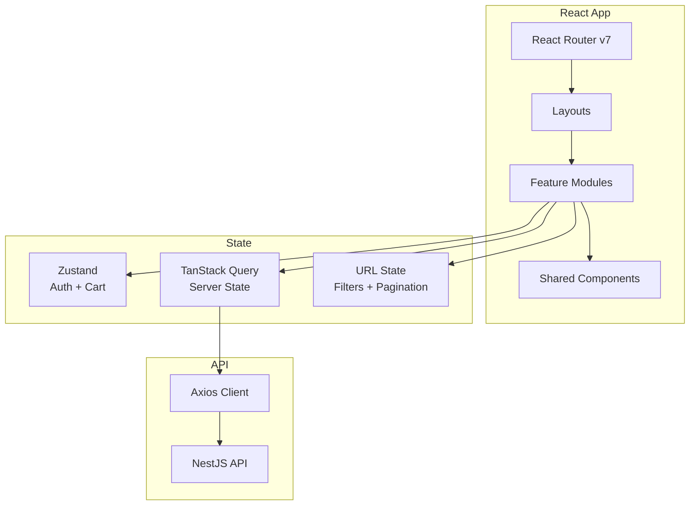
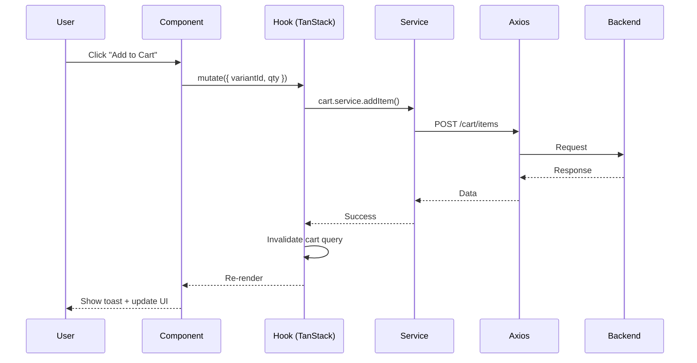
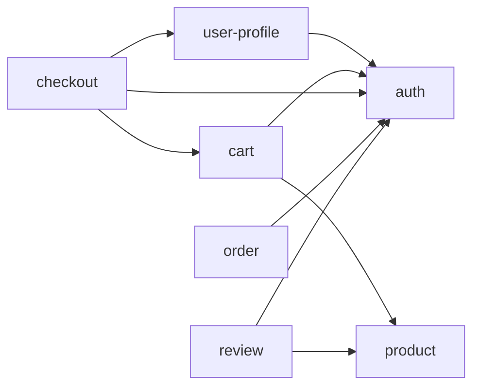

# Frontend Architecture

## Overview



**Architecture**: Feature-based modules (self-contained)

### Tech Stack Justification

| Tech | Why |
|------|-----|
| React 19 + Vite | Fast HMR, modern React features |
| TypeScript strict | Type safety, better DX |
| TanStack Query | Server state, caching, auto-refetch |
| Zustand | Minimal global state (auth, cart) |
| React Router v7 | Type-safe routes, modern API |
| Tailwind CSS | Utility-first, consistent design |

---

## Folder Structure

```
src/
├── main.tsx                    # Entry point
├── App.tsx                     # Providers wrapper
├── config/
│   └── constants.ts            # API_BASE_URL, etc.
├── routes/
│   ├── index.tsx               # createBrowserRouter
│   ├── routes.ts               # ROUTES constants
│   ├── ProtectedRoute.tsx
│   └── AdminRoute.tsx
├── shared/
│   ├── components/
│   │   ├── ui/                 # Button, Input, Modal
│   │   ├── feedback/           # Toast, Skeleton, Spinner
│   │   └── layout/             # Header, Footer
│   ├── hooks/                  # useDebounce, useLocalStorage
│   ├── lib/
│   │   ├── axios.ts            # Axios + interceptors
│   │   └── queryClient.ts      # TanStack config
│   ├── types/                  # ApiResponse, PaginatedResponse
│   └── utils/                  # formatPrice, formatDate
├── layouts/
│   ├── MainLayout.tsx
│   ├── AuthLayout.tsx
│   └── AdminLayout.tsx
├── features/
│   ├── auth/
│   ├── user-profile/
│   ├── product/
│   ├── cart/
│   ├── checkout/
│   ├── order/
│   └── review/
└── assets/
```

---

## Feature Anatomy

### Auth Feature
```
features/auth/
├── components/
│   ├── LoginForm.tsx
│   └── RegisterForm.tsx
├── hooks/
│   ├── useLogin.ts             # useMutation
│   └── useRegister.ts          # useMutation
├── services/
│   └── auth.service.ts
├── stores/
│   └── auth.store.ts           # user, token, isAuthenticated
├── types/
├── pages/
│   ├── LoginPage.tsx
│   └── RegisterPage.tsx
└── index.ts
```

### Product Feature
```
features/product/
├── components/
│   ├── ProductCard.tsx
│   ├── ProductList.tsx
│   ├── ProductFilters.tsx
│   ├── VariantSelector.tsx
│   └── ProductImageGallery.tsx
├── hooks/
│   ├── useProducts.ts          # useQuery + filters
│   └── useProductDetail.ts
├── services/
│   └── product.service.ts
├── pages/
│   ├── ProductListPage.tsx
│   └── ProductDetailPage.tsx
└── index.ts
```

### Cart Feature
```
features/cart/
├── components/
│   ├── CartIcon.tsx            # Badge in header
│   ├── CartDrawer.tsx
│   └── CartItem.tsx
├── hooks/
│   ├── useCart.ts
│   └── useAddToCart.ts         # Optimistic update
├── stores/
│   └── cart.store.ts           # Persist to localStorage
└── index.ts
```

---

## Data Flow



### Example: Checkout Flow

```
1. User fills form → CheckoutForm
2. Submit → useCheckout().mutate(data)
3. Hook → checkout.service.createOrder()
4. Service → POST /orders/checkout
5. Success → Clear cart, redirect to confirmation
6. Error → Show toast, keep form data
```

---

## Routing (React Router v7)

### Route Constants

```ts
// routes/routes.ts
export const ROUTES = {
  HOME: '/',
  LOGIN: '/login',
  REGISTER: '/register',
  PRODUCTS: '/products',
  PRODUCT_DETAIL: '/products/:slug',
  CATEGORY: '/categories/:slug',
  CART: '/cart',
  CHECKOUT: '/checkout',
  ORDERS: '/orders',
  ORDER_DETAIL: '/orders/:id',
  PROFILE: '/profile',
  ADMIN_PRODUCTS: '/admin/products',
  ADMIN_ORDERS: '/admin/orders',
} as const;
```

### Route Config

```tsx
// routes/index.tsx
import { createBrowserRouter } from 'react-router';

export const router = createBrowserRouter([
  {
    path: '/',
    element: <MainLayout />,
    children: [
      { index: true, element: <HomePage /> },
      { path: 'products', element: <ProductListPage /> },
      { path: 'products/:slug', element: <ProductDetailPage /> },
    ],
  },
  {
    element: <ProtectedRoute />,
    children: [
      {
        element: <MainLayout />,
        children: [
          { path: 'cart', element: <CartPage /> },
          { path: 'checkout', element: <CheckoutPage /> },
          { path: 'orders', element: <OrderListPage /> },
        ],
      },
    ],
  },
  {
    path: '/admin',
    element: <AdminRoute />,
    children: [
      { element: <AdminLayout />, children: [...] },
    ],
  },
]);
```

### Navigation

```tsx
import { useNavigate, useParams, useSearchParams } from 'react-router';

const navigate = useNavigate();
const { slug } = useParams<{ slug: string }>();
const [searchParams, setSearchParams] = useSearchParams();

// Navigate
navigate(ROUTES.PRODUCT_DETAIL.replace(':slug', slug));

// URL state for filters
setSearchParams({ page: '2', category: '5' });
```

---

## State Management

| State Type | Tool | Example |
|------------|------|---------|
| Server state | TanStack Query | Products, orders, reviews |
| Auth state | Zustand | user, token, isAuthenticated |
| Cart state | Zustand + persist | cartItems, cartCount |
| URL state | useSearchParams | filters, pagination |
| Form state | React Hook Form | checkout, review forms |
| Local UI | useState | modal open, dropdown |

### Rules

- ✅ Server data → TanStack Query (NEVER Zustand)
- ✅ Auth/Cart → Zustand (cross-feature access)
- ✅ Filters → URL params (shareable, bookmarkable)
- ✅ Forms → React Hook Form
- ❌ Don't store API data in Zustand

---

## API Layer

```
axios.ts (interceptors)
    ↓
[feature].service.ts (endpoints)
    ↓
use[Feature].ts (TanStack hooks)
    ↓
Component.tsx (UI)
```

### Example

```ts
// services/product.service.ts
export const productService = {
  getProducts: (params: ProductParams) =>
    axios.get<PaginatedResponse<Product>>('/products', { params }),
  getBySlug: (slug: string) =>
    axios.get<ApiResponse<Product>>(`/products/${slug}`),
};

// hooks/useProducts.ts
export const useProducts = (params: ProductParams) =>
  useQuery({
    queryKey: ['products', params],
    queryFn: () => productService.getProducts(params),
  });
```

---

## Cross-Feature Communication



| Method | Use Case |
|--------|----------|
| Zustand store | Auth state, cart count in header |
| TanStack cache | Shared product data |
| URL params | Filters, pagination |
| Barrel exports | Feature public API |

---

## Shared vs Features

| Shared | Features |
|--------|----------|
| Button, Input, Modal | ProductCard, CartItem |
| useDebounce, useLocalStorage | useProducts, useCart |
| axios instance | product.service |
| ApiResponse types | Product, Cart types |
| formatPrice utils | getVariantPrice |
| Skeleton, Spinner | ProductSkeleton |

### Import Rules

```tsx
// ✅ Features import from shared
import { Button } from '@/shared/components/ui';

// ✅ Features import other features' public API
import { useCart } from '@/features/cart';

// ❌ Never import feature internals
import { CartItem } from '@/features/cart/components/CartItem';
```